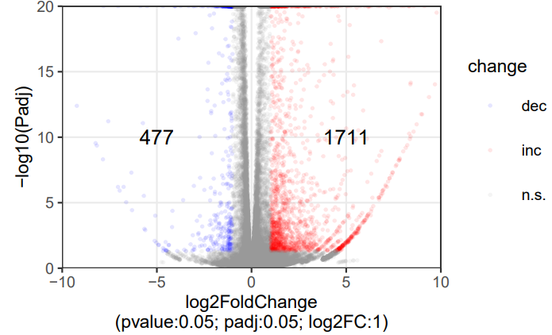
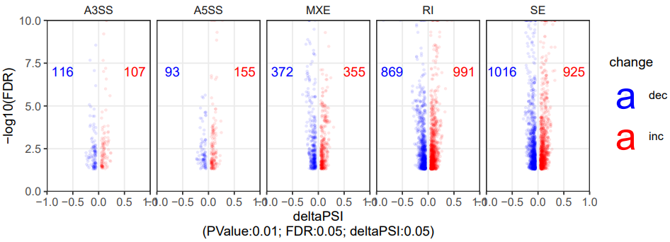
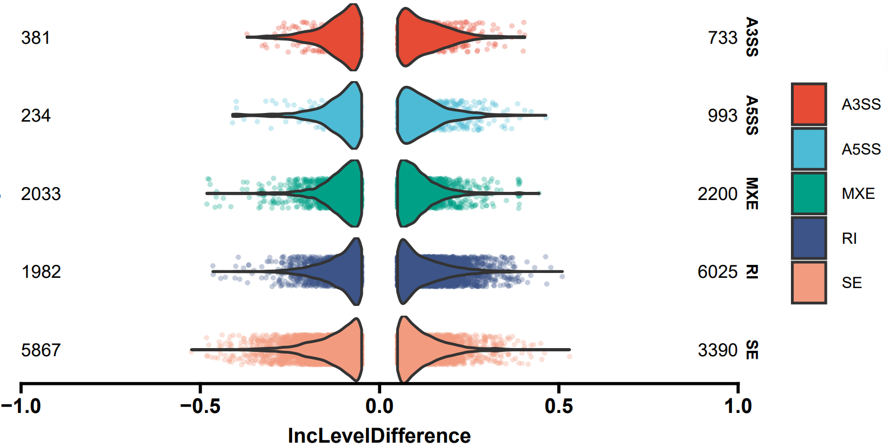

# simpleRNASeq 
Let RNA-seq analysis simple and easy to repeat!

# Description
simpleRNASeq mainly consists of differentially gene expression (DEG) analysis and alternative splicing (DAS) analysis, followed by downstream data visualization and others.

# install
You can use devtools to install `simpleRNASeq`
```r
devtools::install_github('git@github.com:LiangShaw/simpleRNASeq.git')
```
# depedent library
- tidyverse. A meta-package. Please install it yourself.
- DESeq2. For differential experssion analysis. Please install it yourself. If don't use, no need to install.
- ggplot2. For plot. Automatically installed.
- ggsci and ggprism. For plotting DAS volcano plot. Automatically installed.

# function Usage
Firstly, import `simpleRNASeq` and other dependent libraries:
```r
library(simpleRNASeq)
library(tidyverse)
library(DESeq2) # if used
```
you can type `help(function)` in R console to view the function help document.

## EasyDESeq
Make use of [DESeq2](https://www.bioconductor.org/packages/release/bioc/vignettes/DESeq2/inst/doc/DESeq2.html) R package and integrate all the steps into only one.
```r
EasyDESeq(count_tab,tlabel,clabel,tRepN,cRepN,pthre=0.05,foldchange=1)
```

## DESeq_to_volcano_plot
provide a table containing three columns at least:
- pvalue
- padj
- log2FoldChange

You can set the **confidence type** (P value or adjusted P value ), **confidence threshold** and **fold change threshold**.  
And set the colors for decrease and increase as you like.  

```r
DESeq_to_volcano_plot(
    tab,pvalue.thres=1,padj.thres=0.05,log2fc.thres=1,
    volcano.title='Gene expression change (treat vs ctrl)',
    yaxis='padj', inc.color='red',dec.color='blue',ns.color='grey60')
```

You will get a list containing a <u>table</u> with change annotation like:  

| | baseMean | log2FoldChange | lfcSE | stat | pvalue | padj | change | yvalue |
|---|---|---|---|---|---|---|---|---|
|PERM1|24.39|-1.942|0.634|-3.061|0.0022|0.006|dec|2.2210|
|ISG15|175.792|-1.137|0.202|-5.603|2.1059e-08|1.082e-07|dec|6.965|
|TAS1R3|101.24|-1.054|0.258|-4.0738|4.623e-05|0.000162|dec|3.7902|

and a <u>volcano plot</u> like:  

  

## rmats_to_volcano_plot
provide a table containing three columns at least:
- PValue
- FDR
- IncLevelDifference

You can set the **confidence type** (P value or FDR ), **confidence threshold** and threshold for inclusion lelvel difference (**delta PSI**).  
And set the colors for decrease and increase as you like.  

```r
rmats_to_volcano_plot(
    tab,PValue.thres=0.05,FDR.thres=0.05,deltaPSI.thres=0.05,
    volcano.title='PSI change (treat vs ctrl)',
    yaxis='FDR', inc.color='red',dec.color='blue',ns.color='grey60')
```

You will get a list containing 
- a <u>table</u> with change annotation
- a volcano plot (below)  
  
- and a violin plot  
  

## readcount_to_TPM
Transfer read count table into TPM value  
```r
readcount_to_TPM(readcount.tab)
```
Table contains:
1. Geneid (or other markers)
2. Length 
3. read count for sample1
4. read count for sample2
5. ......

## *merge_similar_terms (test version)
Deduplicate GO terms for GO enrichment result from R package [gprofiler2](https://cran.r-project.org/web/packages/gprofiler2/vignettes/gprofiler2.html).

## other scripts
There are some mini shell scripts (in src/) for running [Rmats](https://rnaseq-mats.sourceforge.io/) and intergrating the result.

# Contributing
Pull requests are welcome.  
For major changes, please open an issue first to discuss what you would like to change.  

👏👏👏 Welcome more practical tools to join in `simpleRNASeq`.